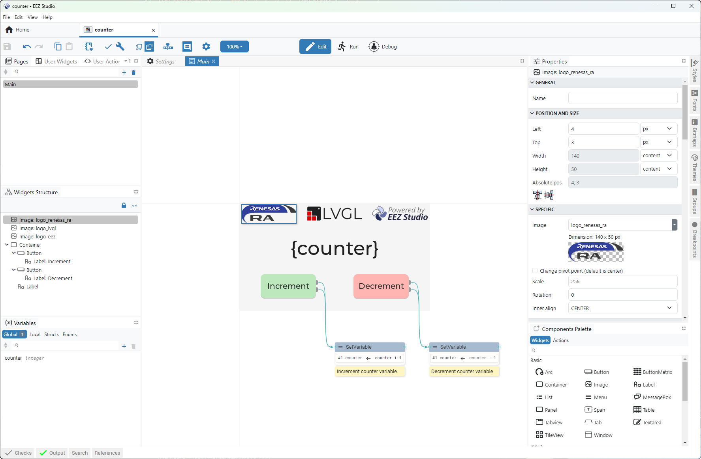

# EEZ Studio example with Renesas EK-RA6M3G and LVGL


Integration steps:

- Open `counter.eez-project` in the [EEZ Studio](https://github.com/eez-open/studio/releases)



- Build the project source code files:


Source code files are generated inside `src/ui` folder.

- Add `ui_init()` and `ui_tick()` in `src/LVGL_thread_entry.c`

```
#include "ui/ui.h" // Add this!

// ...

void LVGL_thread_entry(void *pvParameters)
{
    lv_init();
    board_init();

    ui_init(); // Add this!

    // ...
    // Comment out LVGL demo
    // ...

    while (1)
    {
        lv_timer_handler();

        ui_tick(); // Add this!

        vTaskDelay (1);
    }
}
```


# LVGL ported to Renesas EK-RA6M3G

## Overview

The EK-RA6M3G evaluation kit enables users to seamlessly evaluate the features of the RA6M3 MCU Group and develop embedded systems applications using Renesas’ Flexible Software Package (FSP) and e2 studio IDE. Utilize rich on-board features along with your choice of popular ecosystem add-ons to bring your big ideas to life.

The MCU has a high-performance Arm Cortex-M4 core and offers a TFT controller with 2D accelerator and JPEG decoder. Additionally, it has Ethernet MAC with individual DMA and USB high-speed interface to ensure high data throughput

## Benchmark

[
](https://www.youtube.com/watch?v=0kar4Ee3Qic)


## Buy

You can purchase the Renesas EK-RA6M3G board from many distributors. See the sources at https://renesas.com/ek-ra6m3g

## Specification

### CPU and Memory
- **MCU:** R7FA6M3AH3CFC (Cortex-M4, 120MHz)
- **RAM:** 640kB internal SRAM
- **Flash:** 2MB internal, 32MB external QSPI Flash
- **GPU:** Dave2D

### Display and Touch
- **Resolution:** 480x272
- **Display Size:** 4.3”
- **Interface:** Parallel RGB565
- **Color Depth:** 16-bit
- **Technology:** TFT-LCD, Transmissive
- **DPI:** 128 px/inch
- **Touch Pad:** Capacitive

### Connectivity
- Micro USB device cable (type-A male to micro-B male)
- Micro USB host cable (type-A male to micro-B male)
- Ethernet patch cable

## Getting started

### Hardware setup
- Attach the LCD PCB to the main PCB. Make sure the arrows match at the bottom side of the PCBs.
- Connect the USB cable to the `Debug` (J10) connector, next to the Ethernet port.

### Software setup
- You can clone the repository with the following command:
    ```
    git clone https://github.com/lvgl/lv_port_renesas_ek-ra6m3g.git --recurse-submodules
    ```
    Downloading the `.zip` from GitHub doesn't work as it doesn't download the submodules.

- Follow the *RA family* section of the [*documentation*](https://docs.lvgl.io/master/integration/chip/renesas.html#get-started-with-the-renesas-ecosystem) to prepare your environment and import the project

## Contribution and Support

If you find any issues with the development board feel free to open an Issue in this repository. For LVGL related issues (features, bugs, etc) please use the main [lvgl repository](https://github.com/lvgl/lvgl). 

If you found a bug and found a solution too please send a Pull request. If you are new to Pull requests refer to [Our Guide](https://docs.lvgl.io/master/CONTRIBUTING.html#pull-request) to learn the basics.

